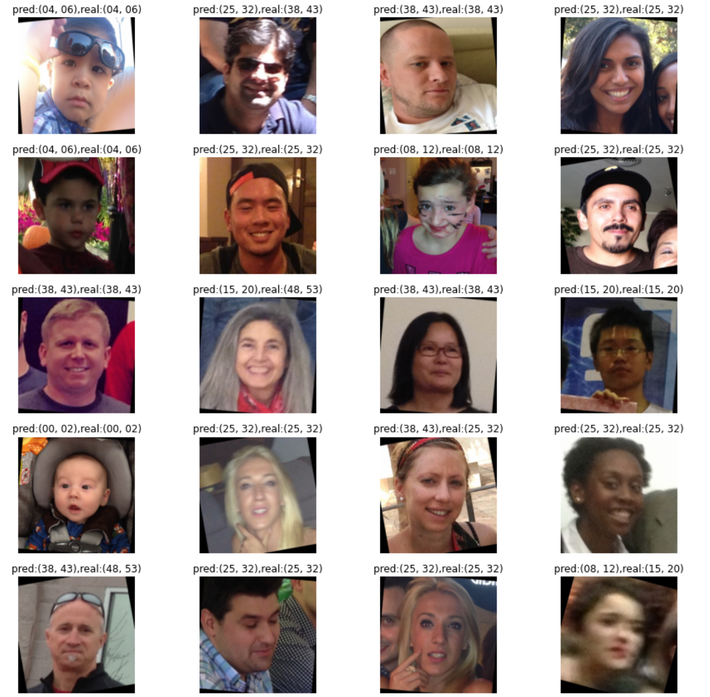

# Age Prediction using Transfer Learning on VGG Architecture

Inspired from paper:  
https://arxiv.org/abs/1709.01664  
Z. Qawaqneh, A. Mallouh and B. Barkana - 
__"Deep Convolutional Neural Network for Age Estimation based on VGG-Face Model"__, University of Bridgeport - 2017
  

## Architecture

The convolutional layers are unchanged and are the same as those of VGG16 architecure. The fully connected layers, however are reduced because of the low number of target classes.  

__FC6__ : 512 neurons  
__FC7__ : 512 neurons  
__FC8__ : 8 neurons (output) 
  

## Dataset
The OUI-Adience Face Image Project is used to train the network.  
https://talhassner.github.io/home/projects/Adience/Adience-data  

__Total number of photos__: 26,580  
__Total number of subjects__: 2,284  
__Age groups__: (0-2), (4-6), (8-13), (15-20), (25-32), (38-43), (48-53), (60-100)
  

## Model
The above network is implemented in pytorch. Take the notebook and the source files with a grain of salt and ensure the files and directory structures rules are met. 

The weights of the convolutional network are loaded from VGG model trained on VGGFace dataset. The model is then fine-tuned. This is essential because of the small number of training data. This also prevents overfitting and ensures faster convergence. 

The weights for pytorch model can be found here :  
http://www.robots.ox.ac.uk/~albanie/models/pytorch-mcn/vgg_face_dag.pth

__Parameter count__:  
Conv &nbsp; : 14714688  
Dense : 13112328  
Total &nbsp;&nbsp; : 27827016  
__Memory__ : 106.15MB
  

## Training
20% of the dataset is used for validation and the other 80% is used for training. 
The model was trained for 3 epochs with constant learning rate 0.01 and momentum 0.9.

The training was done on Google Colab with GPU acceleration. The corresponding notebook is `age_estimate.ipynb`. The model took approximately 120 minutes to train.
  

## Results
__Accuracy__ : The final validation accuracy is 69.6% while final training accuracy is 68.6%. This shows that the model is generalizing to the inputs it has never seen before.

__Confusion Matrix__ : 
It appears that the model confuses between age groups 15-20 and 25-32 and also 38-43 and 25-32. This is intuitive because the facial features vary very slightly between those age groups.

| Pred→ |  0-2 |  4-6 | 8-13 | 15-20 | 25-32 | 38-43 | 48-53 | 60-|
| ---     | :---:| :---:| :---:| :---: | :---: | :---: | :---: | :---: |
|__0-2__  | __87.97__| 11.00|  0.00|  0.62 |  0.41 |  0.00 |  0.00 |  0.00 |
|__4-6__  |  5.411| __89.41__|  3.06|  1.18 |  0.94 |  0.00 |  0.00 |  0.00 |
|__8-13__ |  0.21|  15.24| __75.99__|  5.43 | 2.30 |  0.84 |  0.00 |  0.00 |
|__15-20__|  0.00|  1.71|  10.54| __48.43__ | 37.61 |  1.71 |  0.00 |  0.00 |
|__25-32__|  0.00|  0.98|  3.03|  4.55 | __84.67__ | 6.51 |  0.27 |  0.00 |
|__38-43__|  0.00|  0.21|  1.85|  1.23 | 44.03 | __47.33__ |  4.53 |  0.82 |
|__48-53__|  0.00|  1.12|  0.00|  2.25 |  14.61 | 49.44 | __25.28__ | 7.30 |
|__60-__  |  0.00|  0.50|  1.49|  0.50 |  6.97 | 25.37 | 36.32 | __28.86__ |
	
	
__One off accuracy__ : One off accuracy is the model predicting one more or one less than the actual age group. For this model, the one-off accuracy is 91.11%
	
__Predictions__ : Some of the predictions along with the images are shown. The labels specify the prediction class along with the actual classes. 

